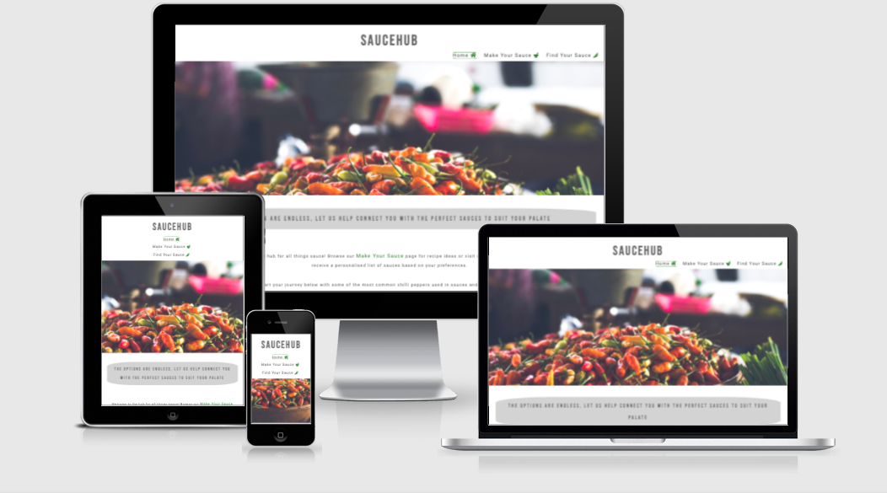
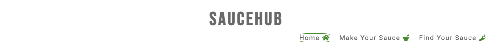
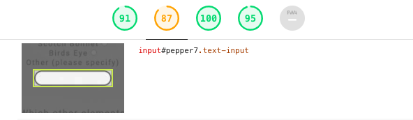
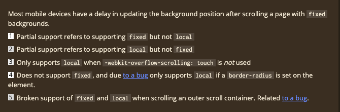
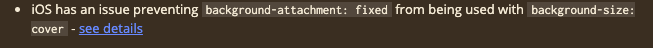

# Saucehub

Sauehub is a site with the objective of matching users with the perfect hot sauce to match their palate and their spice level, as well as providing a hub of recipes to make their own.

The site is targeted to those who currently use hot sauce and want to find more choice by providing both homemade and shop bought options catered to their palate. In addition to this, the site also caters to those who may not have much current knowledge but who would like to explore this and find out more about how they can find the right sauce for them.

[View site by clicking here](https://yasminebb.github.io/saucehub/index.html)

## User Experience

### User Stories

* As a site creator:
  
  - I want to make the site visually appealing upon first visit so the user is intrigued to explore the site further.
  - I want to make sure the site is easy to navigate for the user.
  - I want the user to be able to easily find sauces to suit their palate.

* As a first time user:
  
  - I want to find sauce options tailored to my palate.
  - I want to find out about the spice levels of various chillies
  - I want to be able to navigate easily throughout the pages.
  
  
* As a returning user:
  
  - I want to easily be able to return to and find recipes matching my spice level.
  - I want to be able to recive updated suggestions of sauces to suit my palate.
  - I want to be able build on the relationship by subscribing to a newsletter to receive updates and connect via social media.

## Design

I wanted a fairly minimalist overall design with a striking image on each page and a range of colours that complement each other.

### Colour Scheme

The colours I have chosen for the site maintain a simple, minimalist look with several shades of grey and a green feature colour.

I chose green to be the feature colour as it matches the green that is often associated with chillies and also matches with the green on the Homepage hero image. It is softer than red, a colour often associated with chillies and hot sauce but can often be too bold, and the green goes with the tone of the site. The green is also used for the icons, borders, when the hover selector is used and to highlight a page for the reader to be directed to.
The greys tie in wih the darker tone of the background images used across the site. White is used as a background colour for the rest of the site.

### Typography 

I wanted a bolder font for the logo and headings, and a softer font for the majority of the text on the site; therefore decided on the following from Google Fonts:

* Bebas Neue
* Roboto

 Bebas Neue is a bold font that stands out to the user, so is used in the logo and h1 and h2 elements. Roboto compliments it nicely, and is used for h3 and all other text on the site. These two fonts are used throughout the site to maintain consistency. Sans Serif is used as a fallback font.

 ### Images 

The images used in the site have a darker, grey tone to them.
* Homepage 
  - The Homepage includes a hero image of a basket of chillies and the colours are stark against the grey background which stands out to the user. 
* Make Your Sauce
  - The Make Your Sauce page includes a background image showing three bottles of suggestively home made sauces, representing the page for recipes.
* Find Your Sauce
  - The Find Your Sauce page includes a background image showing shelves filled with sauces, representing the page for finding bought sauces. The grey tone of this image ties in with the colour scheme for the site.

## Features

### Logo and Navigation Bar

The logo and navigation bar are all fully responsive, featuring on all three pages on the navigation bar, as well as the Thank You page the user sees when submitting the form on the Find Your Sauce page. 

The navigation bar contains Font Awesome icons to visually illustrate what the pages on the site represent.
* A Home icon for the Home page
* A Mortar and Pestle icon to represent the recipes on the Make Your Sauce page
* A Chilli icon to represent the Find Your Sauce page

The chilli icon is also used again on the homepage and recipes page to represent the sites intentions for example to illustrate the spice level which UX DESIGN

The navigation bar has a hover feature which is fixed on the active page and appears when a user hovers over the other pages. 

### Homepage

Beneath the hero image is some leading text which, alongside the photo, hopes to show the user that this page will provide them with both what they are looking for as well as the incentive to stay and explore the site. This slogan text also links to the Find Your Sauce and Make your sauce pages and is highlighted in green with a slightly larger font to maintain good accessibility.

### Your Spice Level Section

The Your Spice Level section provides a visual representation of what is to come on the page, with a list of common chillies used and their spice level. This will help them when going on to look for sauces in their preferred spice level range. 

### Footer Section

The footer section contains links to the four main social media sites:

* Instagram
* Twitter
* Facebook
* Youtube
  
In tying in with the colour scheme of the site, they are dimgray with a green hover feature. When clicked they open in a new tab. 
This feature encourages the user to stay connected through social media.

### Find Your Sauce page
The Find Your Sauce page has a form where users can answer questions to help them find the right sauce to suit their palate, based on the answers they provide. There aren’t too many questions and this is to avoid deterring the user, particularly on first visit, with a time consuming form.

The intention is to provide the user with a short selection of sauces on the first use and on future visits, provide updated lists so as to stay up to date and give the user another reason to return.

### Make Your Sauce page
In addition to the Find Your Sauce page, the Make Your Sauce page provides the user with recipes, currently ranging from Mild to Hot. At the moment there is one recipe for each category and this would be expanded in future.  

### Thank You (Form Submit)
The user is directed to a Thank You page after submitting the form on the Find Your Sauce page which encourages them to connect via social media and redirects them to the Make Your sauce page.

### Future Features 

* Share Your Sauce
  - Building on the Find Your sauce and Make Your Sauce pages, a feature idea for the future is to create a Share Your Sauce page which users can use as a hub to collaborate and share their recipe ideas in line with the varying spice range. 
  - When you click on the name of the chilli used in each recipe, it takes you to a page with all the recipes for that specific chilli.

* Wider categories on Make Your Sauce page
  - The Make Your Sauce page will expand to feature more recipes with a wider scope of spice level.
* Page on flavour profiles
  - Tying in with the *Which other elements do you like in your hot sauce?* question on the Find Your Sauce form, the site will expand to have a page explaining all of the elements that can be found and used in sauce recipes, with suggestions of what other ingredients to pair them with.

## Testing

### Validator Testing

* HTML
  - All HTML was passed through the W3C validator, passing with no errors.
  
* CSS
  - All CSS was passed through the Jigsaw W3C validator, passing with no errors.

The majority of testing was done using the Google Chrome Browser. Chrome Developer Tools was used extensively, particularly to check responsiveness on different screen sizes. 
Testing was also done using Safari and Mozilla Firefox on desktop, and again on Google Chrome and Safari using an iPhone 11. 

### Chrome Dev Tools Lighthouse 

When running Lighthouse testing, I used an incognito window after I was having some issues with performance ratings caused by my Chrome extensions.

* [Lighthouse Testing Images](lighthouse.md)

One issue that was flagged when running Lighthouse checks are:
* The background colour (#D3D3D3) initially used on text-input on the form didn't have a high level of contrast against the form background colour. This colour has been changed to a darker colour (#222224) for better accessibility.
  

### Mobile and Desktop Testing
* Logo and Navigation Bar
  - User can easily navigate to all pages, from all pages, and can navigate back to the Home Page when clicking the Saucehub logo. 
  
* Home Page
  - User is navigated to the Make Your Sauce and Find your Sauce pages when clicked on links and these are highlighted in green with a slightly larger font size to be accessible to the user.
* Make Your Sauce Page
  - User is navigated to relevent recipe upon clicking either Mild, Medium or Hot.
* Find Your Sauce Page
  - User must complete all required sections before submitting the form.
  - User gets a warning if failing to use @ when typing their email address.
  - User is taken to Thank You page when submitting the form.
* Thank You Page
  - User can navigate to any other page after subitting the form.
  - User is able to click on suggested link to Make Your Sauce page as a next step which is also highlighted in green with a slightly larger font size to be accessible to the user.

### Responsiveness - Mobile 
The site is reponsive on screensizes down to 320px, the smallest mobile screensize.

Using media queries, I have made the following uodates to ensure responsiveness across a range of screen sizes.

* Adjusting the width size for the recipes on the Make Your Sauce page and the form on the Find Your Sauce page.
* Adding a flex-direction property to layer the navigation bar for screen sizes 768px and down.
* Add a column property to the social media icons for screen sizes 576px and down.
* Remove the hover selector on the recipes page Mild, Medium, Hot section for screen sizes 768px and down as its not user friendly on mobile view and is better suited to desktop view.

### Known Bugs

One bug that remains after testing is the background images not rendering on iOS devices, which dont support the background-attachment: fixed property, due to a bug. This is the case on both Safari and Chrome.

In testing this issue I first compressed the images which didnt solve the issue.
After deliberating, I decided not to redesign and compromise on the styling, which works on the majority of devices and on desktop, for the purposes of this project.

## Deployment

### GitHub Pages
To view a live preview of the site, the code has been deployed via GitHub pages. The following steps are to be followed in order to deploy via GitHub Pages:

1. Log into GitHub account.
2. Navigate to the Repository.
3. Click on the 'Settings' tab.
4. Navigate to 'GitHub Pages' on the lefthand sidebar.
5. Under 'Source', select the dropdown which will be titled 'None'.
6. Select 'Main'.
7. Click 'Save'.

## Credits

### Technologies Used

* [GitHub](https://github.com/)
  - GitHub was used to create the repository and deploy the site.
* [Google Fonts](https://fonts.google.com/)
  - Bebas Neue and Roboto fonts used in the site are taken from Google Fonts.
* [Font Awesome](https://fontawesome.com/)
  - Icons used in the navigation bar and the social media icons used in the footer section are taken from Font Awesome.
* [Coolers.co](https://coolors.co/)
  - The colour scheme was generated in Coolers.
* [Am I Responsive](http://ami.responsivedesign.is/)
  - Am I Responsive was used as part of my testing of the sites responsiveness on various screen sizes.
* [Can I Use](https://caniuse.com/)
  - Can I Use was used when investigating bugs, specifically the bug found on the background-attachment:fixed property on iOS devices.
* [Compressor.io](https://compressor.io)
  - compressor was used to compress the images used on the site.

### Content

* All other content is the developers own.

### Media

* The landing page hero image was taken from [pexels](https://www.pexels.com/photo/focus-photo-of-round-brown-wooden-bowl-filled-with-chili-lot-1092612/).
* The Make Your Sauce page background image was taken from [unsplash](https://unsplash.com/photos/yzBnzI2kOmg).
* The Find Your Sauce page background image was taken from [unsplash](https://unsplash.com/photos/HsTLD7Z2bf0).

