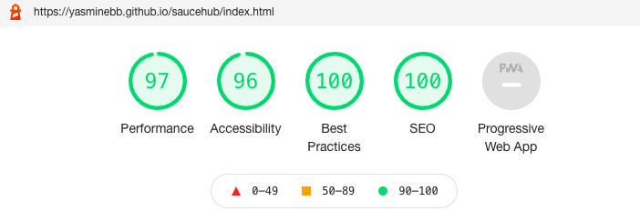
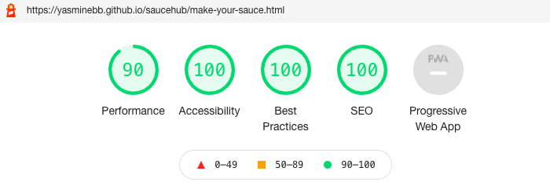
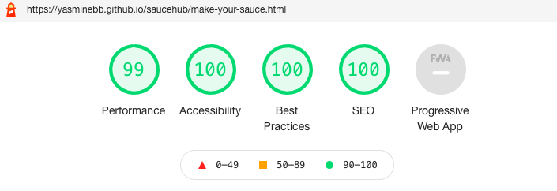
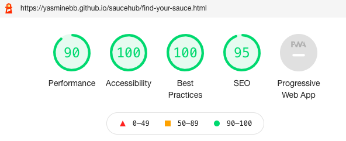

* index.html (Mobile)- Lighthouse 

* index.html (Desktop)- Lighthouse 
  

* makeyoursauce.html (Mobile)- Lighthouse 
  

* makeyoursauce.html (Desktop)- Lighthouse 
  

* findyoursauce.html (Mobile)- Lighthouse 
  

* findyoursauce.html (Desktop)- Lighthouse 
  

[Click here to go back to the Testing section](https://github.com/YasmineBB/saucehub/blob/main/README.md#chrome-dev-tools-lighthouse)